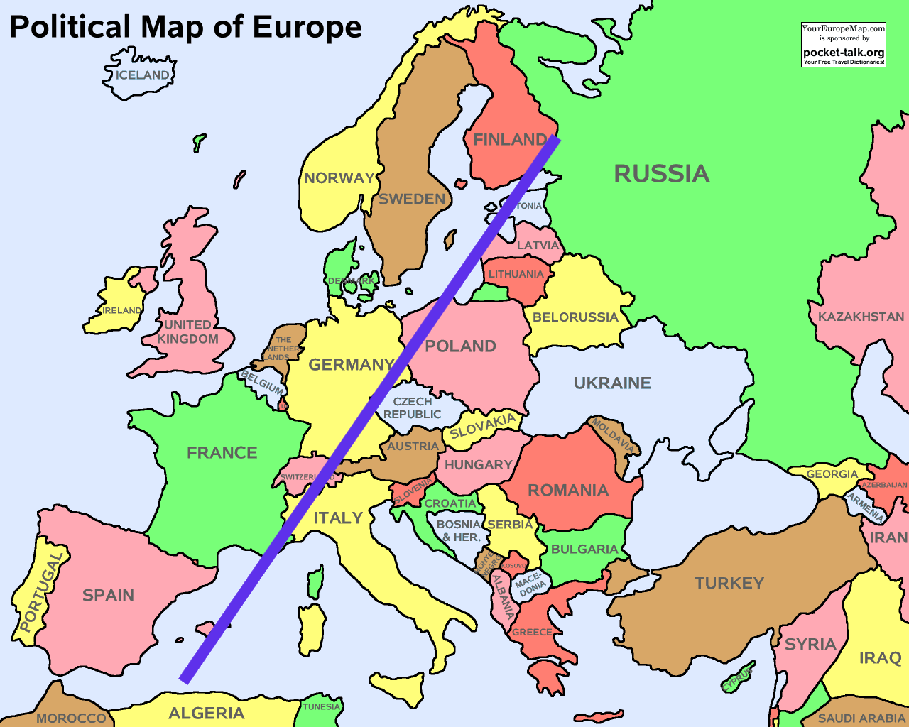

# LGBT discrimination in the EU - intuition vs analysis

## The survey

## A quick look at the data

## Methodology

## Question 1: do LGBT people feel less discriminated in Germany compared to France?

I am french but I'm living in Berlin since 8 years. My gut feeling says there's more acceptance towards LGBT people in Germany than in France but I would like to go through the data and look at what we can find out regarding this question.
I also have to take personal biases into account. I was born and grew up in a very small village in south of France, which is not quite representative of the whole french population. Similarly for Germany, I've only lived in Berlin which seems much more LGBT-friendly that many other places, including the rest of Germany.

So let's see what we can see from the data:

## Question 2: is there a diagonal in Europe?

I've got to travel quite a bit and have had the chance to meet people from many many different countries. I'd say that Scandinavia and western Europe tend to be acceptive towards LGBT, while eastern Europe would be on the other side of the spectrum.

